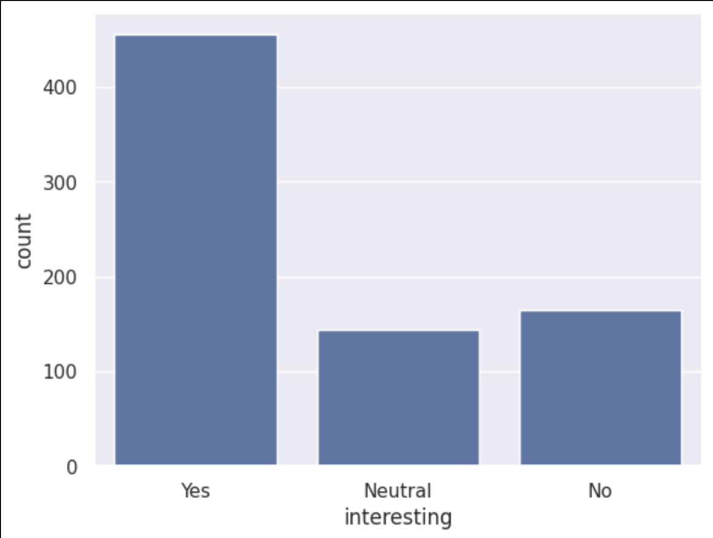
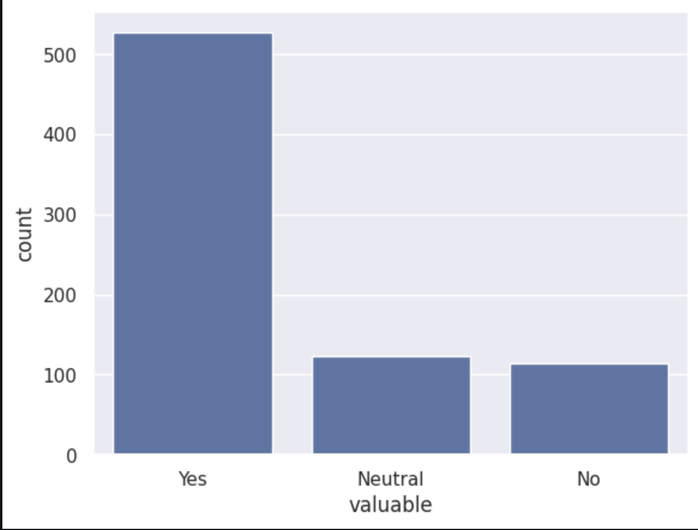
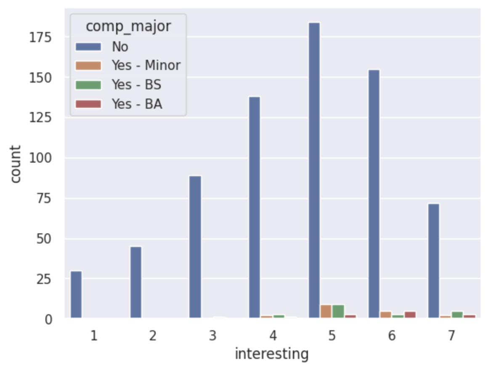
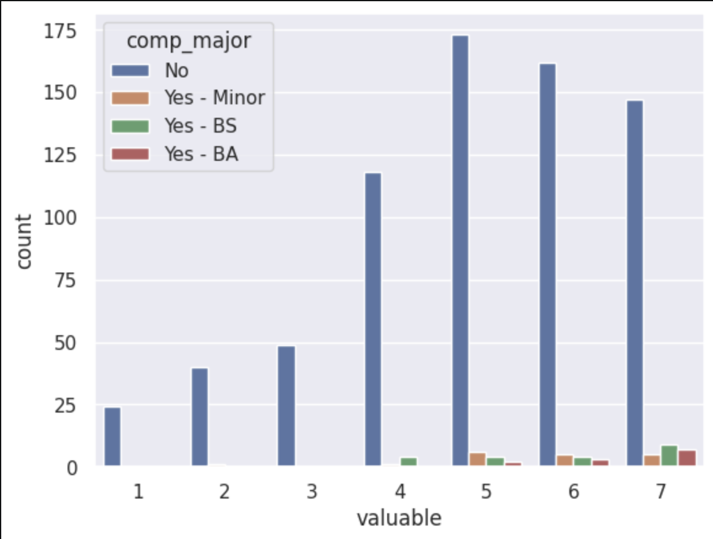
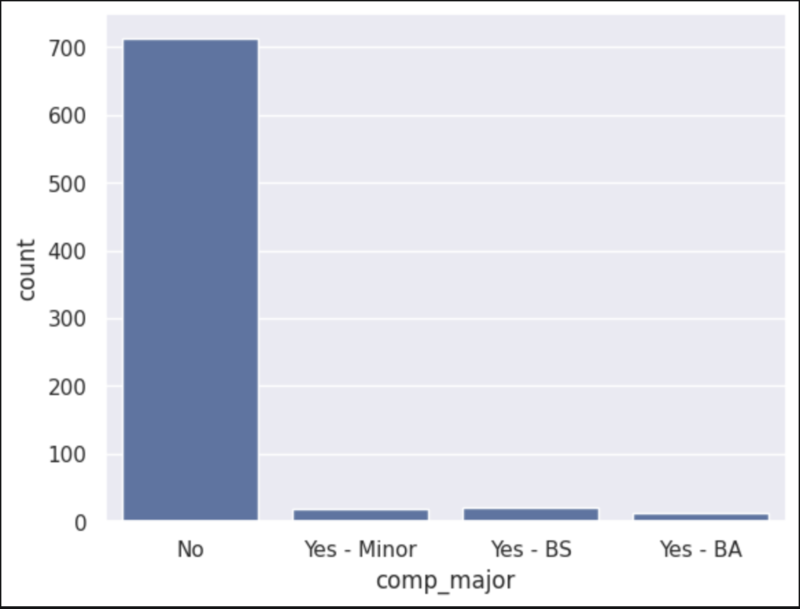

---
# Do not edit the text between these lines!
layout: default
---

# EX09 Project - Brian and Megan

<!-- This is a comment. Below, you'll see code for inserting an image. To make this image appear, update <custom-path>. To add an image, save it inside the imgs folder of this repository. -->
Figure 1:

Figure 2:

Figure 3:

Figure 4:

Figure 5:

## Summary of Data Analysis:
When posing our idea, we proposed that the course should expand its content and converage to ensure that students from Non-COMP backgrounds find the material more relevant and that the concepts are more broadly applicable. This is because many students enrolled in COMP 110 aren't majoring in Computer Science; Rather, they're majored in Business, Neuroscience, and so on. The summary is included below: 
1) ~450 students are interested in the material, while ~300 students are either neutral or not interested.
2) Over 500 students believe that there is value to the course material being taught in terms of future applicability. 
3) 1 being zero interest/value, 7 being full interest/value. Among computer science majors, students believe there is both interest and value in the course, with everyone voting above 4. For non-COMP students, it is more evenly distributed across both interest and value between 1-7.
4) Over 700 students aren't majoring in Computer Science, while less than 50 students are either majoring or minoring in COMP
<<<<<<< HEAD
## CONCLUSION:

Despite ~700 students being non-Computer Science majors, 500 students found the course content interesting and 500 students found the content useful. Moreover, student interest exhibited a approximately normal curve, with substantial overlap between non-Computer Science majors and Computer Science majors, showing little-to-none correlation between the major and the interest in the course. Overall, the data refutes the claim that the course should be more tailored to a broader selection of interests, backgrounds, and majors. 

Instead of tailoring the course to other majors, COMP 110, according to the data, should aim to teach the broader principles of computer science and computational thinking, given that most students are not COMP majors but still believe in the usefulness and applicablility of the course. The overall mean rating for Non-Computer Science students, in terms of course value, lands between 4 and 5 out of 7, while all computer science students rate the value of the course at 4 or above. Despite most students being Non-Computer Science students, the majority of students believe in the value of the course, especially when considering future usefulness. 

In the future, the survey could better define "value," or allow students to explain their responses more clearly. Students may interpret value differently---such as applicability to their career, to their research, to their day-to-day life, and so on---which could influence how the course is designed or refined. Furthermore, future iterations could maintain a broad curriculum while adding optional applications tailored to different fields, providing students the flexibility to tailor their own experience while maintaining a structured core foundation. 

=======
